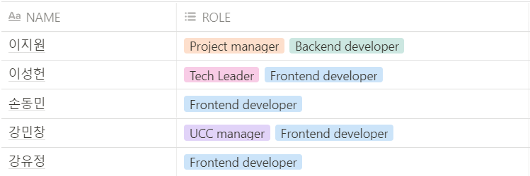
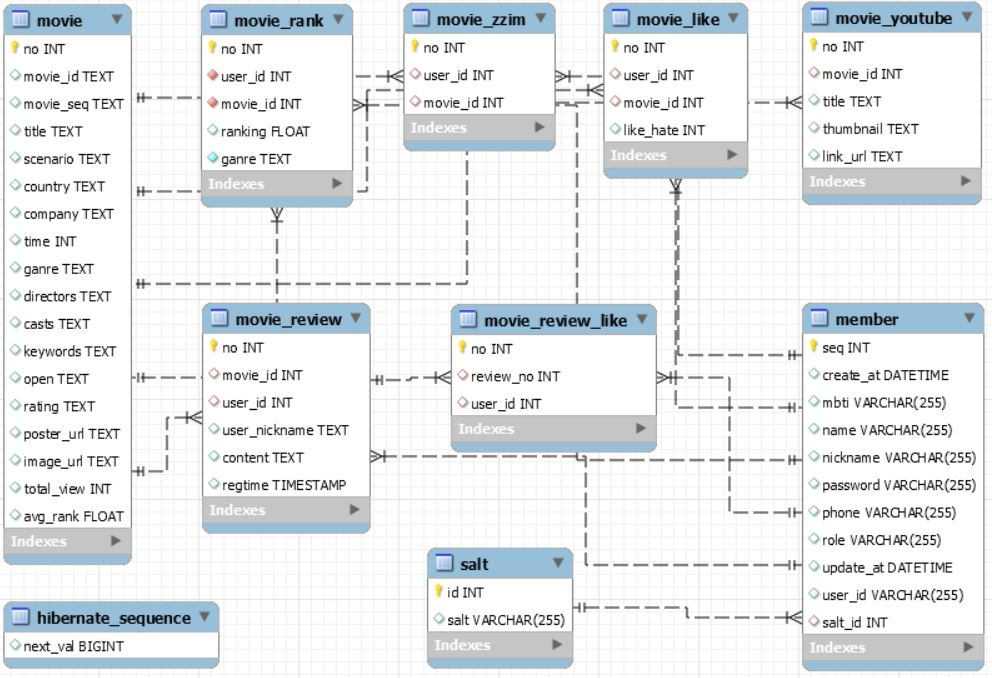

# [넷챠](https://lab.ssafy.com/s04-bigdata-sub2/s04p23d105) - 비디오 스트리밍 웹서비스  

   

[기획안 [넷차-NETCHA\]](https://www.notion.so/NETCHA-72ed718f85484ea88000e5e69d0e089d)

------

## ✒ 서비스 한 줄 요약

넷챠는 넷플릭스와 왓차처럼 개인화 된 추천알고리즘을 기반으로한 비디오 스트리밍 웹서비스를 만들어보자는 취지에서 만들어진 프로젝트입니다.


## 🎫 프로젝트명

넷챠 (NETCHA)


## 📖 기획 배경

프로젝트 수행 목적을 개발자로서의 역량을 키우는데에 중점을 두고 이미 잘 만들어진 서비스를 클론 코딩해보며, 추가적인 기능을 구현해보자는 취지로 넷챠를 기획하게 되었습니다.


## 👥 팀 구성



​	**MY ROLE**

- Netcha Front-end 개발
  - 홈 화면
  - 찜 화면
  - 평가하기 화면
  - 영화 상세정보
- HLS 서비스 개발
  - AWS S3 stroage
  - AWS CloudFront
  - hls.js
- 추천 알고리즘 구현
  - 컨텐츠 기반
  - 협업 필터링 기반


## 📑 프로젝트 상세 소개

**🕹 What features does our service provide?**

​	사용자가 보고싶은 영화를 보여줍니다. 

​	우리의 개인화된 추천 알고리즘을 이용해 영화를 추천해줍니다. 

​	리뷰를 작성할 수 있고, 다른 사용자가 작성한 리뷰도 볼 수 있어요. 

​	사용자별 영화 취향 분석을 보여줍니다.

​	보고싶은영화를 찜해두어 언제든 바로 찾을수 있어요.

​	영화를 평가하면서 사용자 취향에 맞는 영화를 추천받을수 있어요.

​	MBTI성향을 기반으로 영화를 추천받을수 있어요.

- **기능 명세 바로가기**

  [기능 명세](https://www.notion.so/4ec97bb09b314fd29ef90ff0e13d31a3)

- **ERD**

  
  
  

## 🔎 상세 화면 및 서비스 흐름 구성

- **넷차 바로가기**
 [상세화면 및 테스트케이스](https://www.notion.so/bd8693c94a1d4ce4a826cd55bea22302)


- **넷차피디아 바로가기**

  [상세화면 및 테스트케이스](https://www.notion.so/bd8693c94a1d4ce4a826cd55bea22302)


## ⚙ 설치 방법

- **백엔드**

  추후 업데이트 예정

- **프론트엔드 - 넷차**

  ```bash
  cd exac/frontend
  npm install
  npm start
  ```

- **프론트엔드 - 넷차피디아**

  ```bash
  cd exac/frontend-pedia
  npm install
  npm start
  ```

  

## 🎬 주요 기능

- 주요 기능은 제가 담당한 **넷차 - 프론트엔드** 개발 위주로 서술하였습니다.

  - 다른 기능도 보고 싶다면??

    - 넷챠 + 넷챠 피디아 기능 소개 UCC 

      🔗https://www.youtube.com/watch?v=fJLitnVILlk

- 회원 가입 및 로그인

  

  - 사용자는 회원가입 과정에서 별도의 버튼없이 자연스럽게 이메일 및 비민번호 중복 체크가 가능
  - 인증메일을 통한 이메일 인증

- 평가하기

  

  - 컨텐츠 기반 추천을 위한 영화 평가하기 기능
  - 영화를 평가하고, 마음에 드는 영화를 찜할 수 있음
  - 평가했던 영화를 다시 클릭하여  Update 및 Delete 할 수 있음
  - 인피니트 스크롤을 적용하여 스클롤을 내릴시 데이터를 추가적으로 불러옴

- 홈화면

  

  - 홈화면은 추천 영화를 슬라이더 형태로 보여줌
  - 빠른 로딩을 위해 인피니트 스크롤로 스클롤을 내릴시 추천 영화 목록이 더보이게 구현
  - 슬라이더는 Redux-Saga를 이용한 비동기 처리로 로딩시 로딩화면이 보이게 처리

- 슬라이더

  

  - 슬라이더의 영화에 0.5초 이상 마우스 오버시 카드형태로 확대되며 영화의 간략 정보가 나옴
  - 마우스 오버시 영화의 썸네일이 영상으로 바뀜
  - 카드아이템에서 영화재생, 찜, 좋아요, 싫어요, 상세보기 기능
  - 슬라이더 양 끝의 영화는 마우스 오버시 화면을 벗어나지 않도록 처리

- 영화 기본정보

  

  - 영화에 상세 정보, 영화 재생, 찜, 좋아요, 싫어요 기능
  - 이미 본 작품이라면 별점 평가 기능
  - HLS를 이용한 빠른 영상 재생

- 영화 상세정보

  

  - 댓글 확인 및 댓글에 좋아요 기능
  - 관련 감독이나 배우의 출연작품 검색 기능

- 영화 비슷한 작품

  

  - 해당 영화와 비슷한 작품을 추천 및 바로 감상 가능
  - 비슷한 영화를 불러올 때 Loading 표시

- 영화 탐색 (필터링)

  

  - 장르 및 국가로 필터링 기능
  - 개봉일순, 오름차순, 내림차순으로 정렬 기능
  - 인피니트 스크롤을 적용하여 스크롤시 추가적으로 데이터 로딩

- 영화 검색

  

  - 영화 제목, 감독, 배우 등을 검색

  - Redux-Saga debounce를 이용하여 타이핑이 0.5초 이상 멈췄을 시 바로 검색 결과를 불러옴

- 내가 찜한 콘텐츠

  

  - 내가 찜한 콘텐츠 확인 가능
  - 찜한 영화 바로 삭제 가능

- 라이트 모드 / 다크 모드

  

  - SCSS를 이용한 라이트 모드 및 다크모드 지원


## 🗓️ 개발 일정

- **개발 일정 바로가기**

  [개발일정](https://www.notion.so/583dbaed2966424989dbe030a35ce373)

## 📚 기술 스택

- **Back-End**
  - Java 8
  - Spring Boot
  - Spring Security
  - JPA Hibernate & Spring Data JPA
- **Front-End**
  - React.js
  - Redux
  - Redux-saga
  - SCSS
  - Material-UI
  - chart.js
  - ReactHlsPlayer
- **Devops & Tools**
  - MySQL
  - AWS EC2
  - AWS S3
  - AWS CloudFront
  - git-flow
  - Jira
  - notion

## 🎲 개발 규칙

- **개발 일정 바로가기**

  [규칙](https://www.notion.so/ef4e38f64d1f4db39ab3270333118876)


## ⏳ 회고

- Keep (좋았던 점)
  - React와 Redux를 공부하고 실제로 도입해볼 수 있었던 점
  - 디자인 프레임워크의 사용비중을 대폭 줄이고 컴포넌트를 직접 만들어 사용한 점
  - SCSS를 도입한 점
- Problem (아쉬운 점)
  - 렌더링 성능을 많이 생각하지 못한 점
  - UseRef, UseCallback, UseMemo 등 React의 다른 Hook들을 잘 활용하지 못한 점
  - 컴포넌트들을 재활용할 수 있게 더 세분화해서 나누지 못한 점
- Try (앞으로 시도할 점)
  - 컴포넌트 구조를 확실하게 잡고 더 세분화해서 설계
  - Hook을 적극 활용해서 렌더링 성능 또한 고려
  - TypeScript + React 를 적용
